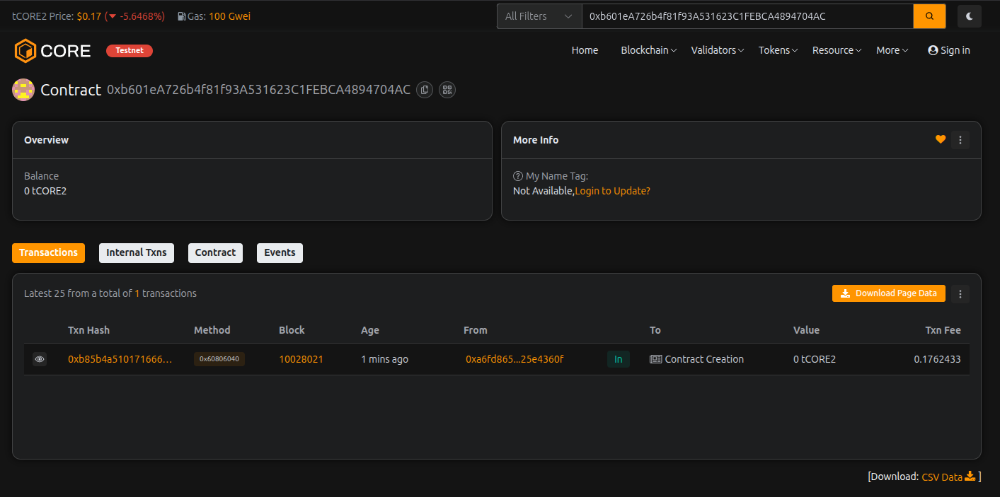

# MultiChain Farm

## Project Description

MultiChain Farm is a decentralized yield farming protocol that enables users to stake their tokens across multiple blockchain networks and earn rewards. The smart contract provides a secure and efficient way to participate in liquidity mining programs with flexible staking pools, customizable reward rates, and built-in security features. Users can stake their assets, earn passive income through rewards, and withdraw their funds after the lock period expires.

The protocol is designed with cross-chain compatibility in mind, allowing for future expansion to multiple blockchain networks. It features a robust pool management system where administrators can create multiple staking pools with different reward rates, making it suitable for various tokenomics models and farming strategies.

## Project Vision

Our vision is to create a truly interoperable and decentralized yield farming ecosystem that bridges multiple blockchain networks. We aim to democratize access to DeFi yield farming opportunities by providing:

- **Cross-Chain Accessibility**: Enable users to farm rewards across different blockchain networks seamlessly
- **Fair Distribution**: Implement transparent and fair reward distribution mechanisms
- **Community Governance**: Evolve towards a DAO model where token holders can vote on pool parameters and protocol upgrades
- **Sustainable Returns**: Create a balanced ecosystem that provides sustainable returns for long-term participants
- **Security First**: Maintain the highest security standards to protect user assets

## Key Features

- **Multiple Staking Pools**: Create and manage multiple independent staking pools with different reward rates
- **Flexible Reward System**: Configurable reward rates that can be adjusted by the contract owner
- **Lock Period Protection**: Built-in lock period mechanism to ensure staking stability and prevent flash farming attacks
- **Real-Time Reward Calculation**: Dynamic reward calculation system that updates in real-time based on staking duration
- **Minimum Stake Requirements**: Configurable minimum stake amount to maintain pool quality
- **Emergency Controls**: Emergency withdrawal function for contract administrators in case of critical situations
- **Pool Status Management**: Ability to activate or deactivate pools as needed
- **Transparent Tracking**: Complete visibility of staked amounts, pending rewards, and pool statistics
- **Gas Optimized**: Efficient smart contract design to minimize transaction costs
- **Event Logging**: Comprehensive event emission for off-chain tracking and analytics

## Future Scope

- **Multi-Token Support**: Expand beyond native tokens to support ERC-20, ERC-721, and other token standards
- **Cross-Chain Bridge Integration**: Implement bridge protocols to enable true multi-chain staking
- **Automated Market Making (AMM)**: Integrate with DEX protocols for automatic liquidity provision
- **NFT Staking**: Add support for NFT staking with unique reward mechanisms
- **Governance Token**: Launch a governance token for decentralized protocol management
- **Compound Rewards**: Implement auto-compounding functionality for reward reinvestment
- **Referral System**: Add referral rewards to incentivize platform growth
- **Advanced Analytics Dashboard**: Develop comprehensive analytics and reporting tools
- **Mobile Application**: Create mobile apps for iOS and Android for easier access
- **Layer 2 Scaling**: Deploy on Layer 2 solutions for reduced gas fees and faster transactions
- **Insurance Protocol**: Integrate with DeFi insurance protocols to protect user funds
- **Flexible Lock Periods**: Allow users to choose custom lock periods with corresponding reward multipliers

## Contract Details:

Transaction id: 0xb601eA726b4f81f93A531623C1FEBCA4894704AC
